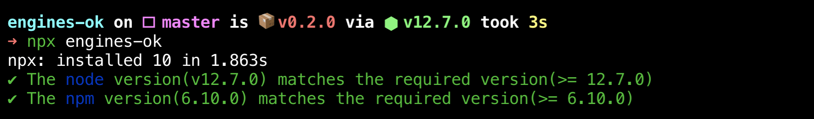

# engines-ok

Checks the engines in *package.json* - **node/npm**

[](https://www.npmjs.com/package/engines-ok)

[](https://www.npmjs.com/package/engines-ok)

## Install

`npm i engines-ok -g`

or, if you'd prefer installing it locally within your project, as

`npm i engines-ok -D`

## Usage

### Basic

```shell
engines-ok
```

### As npm hooks

package.json

```js
"scripts": {
  "preinstall": "npx engines-ok"
}
```

## Authors

- [Dhruv Jain](https://github.com/maddhruv)

---

[](https://cleartax.in)
